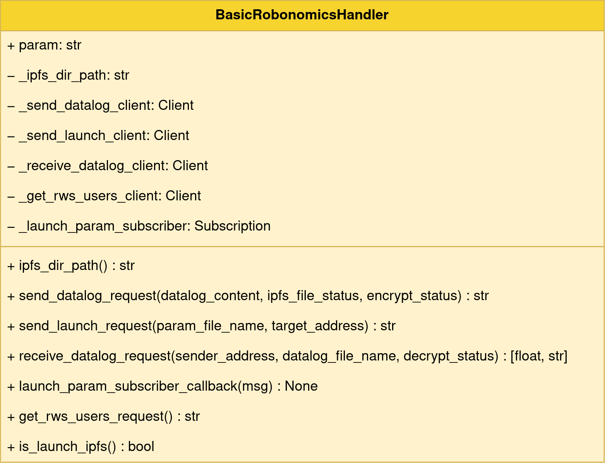

<a name="readme-top"></a>

<!-- PROJECT SHIELDS -->
[![Contributors][contributors-shield]][contributors-url]
[![Forks][forks-shield]][forks-url]
[![Stargazers][stars-shield]][stars-url]
[![Issues][issues-shield]][issues-url]
[![Apache-2.0 License][license-shield]][license-url]


<!-- PROJECT TITLE -->
<br />
<div align="center">
<h3 align="center">Robonomics ROS 2 Wrapper</h3>

<p align="center">
    Python packages with simple wrapper of Robonomics parachain functions for Robot Operating System 2
</p>
</div>

<!-- TABLE OF CONTENTS -->
<details>
  <summary>Table of Contents</summary>
  <ol>
    <li>
      <a href="#about-the-project">About Project</a>
      <ul>
        <li><a href="#project-structure">Project Structure</a></li>
      </ul>
    </li>
    <li>
      <a href="#getting-started">Getting Started</a>
      <ul>
        <li><a href="#prerequisites">Prerequisites</a></li>
        <li><a href="#installation-and-building">Installation and Building</a></li>
        <li><a href="#configuration">Configuration</a></li>
      </ul>
    </li>
    <li>
      <a href="#usage">Usage</a>
        <ul>
        <li><a href="#testing-with-turtlesim">Testing with Turtlesim</a></li>
        <li><a href="#programming-your-wrapper-implementation">Programming Your Wrapper Implementation</a></li>
        </ul>
    </li>
    <li><a href="#roadmap">Roadmap</a></li>
    <li><a href="#contributing">Contributing</a></li>
    <li><a href="#license">License</a></li>
    <li><a href="#contact">Contact</a></li>
    <li><a href="#acknowledgments">Acknowledgments</a></li>
  </ol>
</details>

<!-- ABOUT THE PROJECT -->
## About Project

This ROS 2 Python packages are dedicated to wrapping the [**Robonomics**](https://robonomics.network/) parachain API 
provided by [**robonomics-interface**](https://github.com/Multi-Agent-io/robonomics-interface) 
into nodes of ROS 2. Robonomics is a decentralized cloud for storing digital twins of robotics and 
IoT devices and control them through this network. 

The goal of the project is to provide ROS 2 developers with a convenient way to integrate their robots or devices 
with parachain features. The logic behind the integration of a robotic device is that a unique address is created 
for it in the Robonomics parachain, which is used to control the device or receive its telemetry.

Available features include: 

* **Launch function** — launching a device to execute any command with a specified set of parameters passed as a file.
* **Datalog function** — publishing any device data in a form of hash to parachain.
* **Usage of Robonomics subscription** — the ability to send transactions without a fee.
* **Secure file storage** — to pack and unpack data, [InterPlanetary File System](https://ipfs.tech/) is used, which allows to access 
files by their unique hash; for convenient usage of IPFS, [Pinata](https://www.pinata.cloud/) support included, which 
allows to pin IPFS files for fast downloading.
* **File encryption and decryption** — protection of files with public key encryption.

To learn more about Robonomics, please refer to the official documentation: 
[wiki.robonomics.network](https://wiki.robonomics.network/).

<p align="right">(<a href="#readme-top">back to top</a>)</p>

### Project Structure

For convenience, the project is divided into several ROS 2 packages:

    .
    ├── config                                   
    │   └── robonomics_pubsub_params_template.yaml    # Config file for account credentials, IPFS directory, etc.
    ├── robonomics_ros2_interfaces                    # A package that describes all types of ROS 2 services and messages
    ├── robonomics_ros2_pubsub                        # Main package for interaction with Robonomics
    │   ├── ipfs_files                                # Default IPFS file storage directory
    │   ├── robonomics_ros2_pubsub              
    │   │   ├── utils                                 # Directory for various utility functions
    │   │   ├── robonomics_ros2_pubsub.py             # Main node for creating ROS 2 services with Robonomics functions
    │   │   └── ...
    │   └── ...
    ├── robonomics_ros2_robot_handler                 # A package with templates of robot-specific wrapper implementations
    │   ├── launch
    │   │   └── robot_template_robonomics_launch.py   # A template for launch file
    │   ├── robonomics_ros2_robot_handler
    │   │   └── basic_robonomics_handler.py           # A base class for accessing the pubsub node finctions
    │   └── ...
    ├── robots                                        # A directory with packages for robot-specific wrapper implementations
    │   └── turtlesim_robonomics                      # A package with turtlesim example for testing
    └── ...

<p align="right">(<a href="#readme-top">back to top</a>)</p>

<!-- GETTING STARTED -->
## Getting Started

### Prerequisites

Make sure you have the following software installed: 

* Linux OS distribution (tested on [Ubuntu 22.04.4](https://releases.ubuntu.com/jammy/))
* ROS 2 distribution (tested on [Humble version](https://docs.ros.org/en/humble/Installation.html))
* [Python 3](https://www.python.org/downloads/) (tested on 3.10.12)
* [IPFS node](https://docs.ipfs.tech/) (tested on [IPFS Kubo](https://docs.ipfs.tech/install/command-line/) 0.26.0)
* Project specific Python modules can be installed via:
    ```shell
    pip install -r requirements.txt
    ```

For testing:

* Turtlesim package for your ROS2 version. For Humble:
    ```shell
    sudo apt install ros-humble-turtlesim
    ```

You also need to create an account on Robonomics parachain and write down seed phrase and account type. Make sure, 
that you have a free account balance to make transactions. The guide is available here:
https://wiki.robonomics.network/docs/create-account-in-dapp

<p align="right">(<a href="#readme-top">back to top</a>)</p>

### Installation and Building

1. Create directory for ROS 2 workspace and the `src` subdirectory:
    ```shell
    mkdir -p your_project_ws/src
    cd your_project_ws/src
    ```

2. Clone this repo to `src` directory:
    ```shell
    git clone https://github.com/Fingerling42/robonomics-ros2.git
    ```

3. Then you can test the repository with turtlesim package or make your own robot-specific wrapper implementations. 
Anyway, after that you need to build the package. From `your_project_ws` directory run:
    ```shell
    colcon build
    ```
   
4. Source the package to the environment (you will need it to do in every console instance):
    ```shell
    source install/setup.bash
    ```

### Configuration

Before starting nodes, you need to set up a configuration file `robonomics_pubsub_params_template.yaml`, which must be 
unique for each launched robot that needs to access Robonomics. Copy the template to any place convenient for you and 
fill in the required fields.

Pay attention to the `account_seed` and `crypto_type` fields, as they determine the account of your robot.

> **WARNING**: The seed phrase is sensitive information that allows anyone to use your account. Make sure you don't 
> upload a config file with it to GitHub or anywhere else.

If you want to use a custom Robonomics node or a local one, change the `remote_node_url` parameter.

If you have a Robonomics subscription that allows you to send transactions without fees, please insert the address 
of the subscription owner to the `rws_owner_address` field. Don't forget that your account must be added 
to your subscription.
   
You may also want to change the directory where the files for IPFS will be stored. To do this, change the 
parameter `ipfs_dir_path`, otherwise it will use the default directory.  The `ipfs_gateway` parameter allows you 
to specify the gateway through which IPFS files will be downloaded.

The `pinata_api_key` and `pinata_api_secret_key` parameters are needed to access Pinata API.

<p align="right">(<a href="#readme-top">back to top</a>)</p>

<!-- USAGE EXAMPLES -->
## Usage

### Testing with Turtlesim

1. First, launch IPFS Daemon:
    ```shell
    ipfs daemon
    ```
   
2. Create two configuration files for two pubsub instances, each for a different Turtlesim.

3. Run the ROS 2 launch files for two turtle with different configuration files and namespaces (this is necessary to 
distinguish between identical nodes). They will launch all necessary nodes: Turtlesim itself, 
wrapper implementation for Turtlesim and Robonomics pubsub:

    ```shell
    ros2 launch turtlesim_robonomics turtlesim_robonomics_launch.py pubsub_params_path:=./turtlesim1_pubsub_params.yaml namespace:='turtlesim1'
    ```
   
    ```shell
    ros2 launch turtlesim_robonomics turtlesim_robonomics_launch.py pubsub_params_path:=./turtlesim2_pubsub_params.yaml namespace:='turtlesim2'
    ```

4. You will see the simulator with turtles and ROS 2 logs in the console with IPFS ID, path to directory with IPFS files,
and Robonomics address. The node starts publish datalogs with turtles position every 2 min. You can check the datalog 
transactions, using, for example, [Subscan](https://robonomics.subscan.io/) explorer (just enter the Robonomics address). 

5. In order for one of the turtle instance to receive the last datalog from another, call the following request to 
the service (do not forget to insert address):

    ```shell
   ros2 service call /turtlesim1/robonomics/receive_datalog robonomics_ros2_interfaces/srv/RobonomicsROS2ReceiveDatalog "{sender_address: 'TURTLE2_ADDRESS', datalog_file_name: 'test_name.json'}"
    ```
   
   A file with the position of one of the turtles will be downloaded to the IPFS directory.

6. The nodes also start waiting for every launch command, that will be sent to specified address. The turtles are 
controlled using `/cmd_vel` topic, so you need to prepare corresponding messages, that will go as a launch parameter. 
For convenience, these messages are prepared as JSON-file:
    ```json
    {
       "linear":{
          "x":[
             1.0,
             2.0
          ],
          "y":[
             0.0,
             0.0
          ],
          "z":[
             0.0,
             0.0
          ]
       },
       "angular":{
          "x":[
             0.0,
             0.0
          ],
          "y":[
             0.0,
             0.0
          ],
          "z":[
             1.0,
             2.0
          ]
       }
    }
    ```
    This JSON example will command the turtle to move twice.
   
7. Save this JSON to IPFS directory of some turtle and run the following:

    ```shell
   ros2 service call /turtlesim1/robonomics/send_launch robonomics_ros2_interfaces/srv/RobonomicsROS2SendLaunch {"param_file_name: 'test_name.json', target_address: 'TURTLE2_ADDRESS'"}
    ```
   
   Watch for the simulation, the turtle should start moving.

<p align="right">(<a href="#readme-top">back to top</a>)</p>

### Programming Your Wrapper Implementation

When programming your own robot, you will need to create a robot-specific wrapper implementation based on 
prepared basic node class `BasicRobonomicsHandler`. Create your ROS 2 Python packages and import the following to your node:

```Python
from robonomics_ros2_robot_handler.basic_robonomics_handler import BasicRobonomicsHandler
...
class YourRobotNode(BasicRobonomicsHandler):

    def __init__(self) -> None:
        super().__init__()
...
```

The class has the structure shown in the figure below.



For the convenience of launching all nodes and pushing a common namespace to them, you can use the launch file template in
the `/robonomics_ros2_robot_handler/launch` directory. This launch file takes two arguments: `pubsub_params_path` and `namespace`.

<p align="right">(<a href="#readme-top">back to top</a>)</p>

<!-- ROADMAP -->
## Roadmap

- [x] Add basic datalog and launch functions
- [x] Add IPFS support
- [x] Add file encryption
- [x] Add support for Robonomics subscription
- [x] Add support for IPFS pinning service (Pinata)
- [x] Add a selection of the IPFS gateway
- [ ] Add digital twin functionality
- [ ] Rosbag2 integration?

You can [open issue](https://github.com/Fingerling42/robonomics-ros2/issues) to request a function or ask for bug fix.

<p align="right">(<a href="#readme-top">back to top</a>)</p>

<!-- CONTRIBUTING -->
## Contributing

If you have a suggestion or correction, please feel free to participate! You should:

1. Fork the project
2. Add and commit your changes
3. Open a pull request

<p align="right">(<a href="#readme-top">back to top</a>)</p>

<!-- LICENSE -->
## License

Distributed under the Apache-2.0 License. See `LICENSE.txt` for more information.

<p align="right">(<a href="#readme-top">back to top</a>)</p>

<!-- CONTACT -->
## Contact

Ivan Berman — [@berman_ivan](https://twitter.com/berman_ivan) — fingerling42@proton.me

<p align="right">(<a href="#readme-top">back to top</a>)</p>

<!-- ACKNOWLEDGMENTS -->
## Acknowledgments

* [robonomics-interface docs](https://airalab.github.io/robonomics-interface)
* [Best-README-Template](https://github.com/othneildrew/Best-README-Template/)

<p align="right">(<a href="#readme-top">back to top</a>)</p>

<!-- MARKDOWN LINKS & IMAGES -->
<!-- https://www.markdownguide.org/basic-syntax/#reference-style-links -->
[contributors-shield]: https://img.shields.io/github/contributors/Fingerling42/robonomics-ros2.svg?style=for-the-badge
[contributors-url]: https://github.com/Fingerling42/robonomics-ros2/graphs/contributors
[forks-shield]: https://img.shields.io/github/forks/Fingerling42/robonomics-ros2.svg?style=for-the-badge
[forks-url]: https://github.com/Fingerling42/robonomics-ros2/network/members
[stars-shield]: https://img.shields.io/github/stars/Fingerling42/robonomics-ros2.svg?style=for-the-badge
[stars-url]: https://github.com/Fingerling42/robonomics-ros2/stargazers
[issues-shield]: https://img.shields.io/github/issues/Fingerling42/robonomics-ros2.svg?style=for-the-badge
[issues-url]: https://github.com/Fingerling42/robonomics-ros2/issues
[license-shield]: https://img.shields.io/github/license/Fingerling42/robonomics-ros2.svg?style=for-the-badge
[license-url]: https://github.com/Fingerling42/robonomics-ros2/blob/master/LICENSE.txt